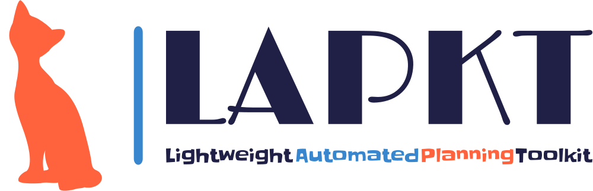

LAPKT aims to make your life easier if your purpose is to create, use or extend basic to advanced Automated Planners. It's an open-source Toolkit written in C++ and Python with simple interfaces that give you complete flexibility by decoupling parsers from problem representations and algorithms. It has been succesfully used in embedded systems, webservices, compilations, replanning and contains some of the high-performance planners from the last International Planning Competition 2014.

AUTHORS
=======

- Miquel Ramirez <miquel.ramirez@gmail.com>
- Nir Lipovetzky <nirlipo@gmail.com>
- Anubhav Singh <anubhav.singh.er@protonmail.com>
- Christian Muise <christian.muise@gmail.com>

OVERVIEW
===========

LAPKT separates search engines from the data structures used to represent
planning tasks. This second component receives the name of 'interface' since
it is indeed the interface that provides the search model to be solved.

Search engine components are meant to be modular, allowing users of LAPKT to
assemble and combine features of different search engines to come up with customized
search strategies, within reason and without sacrificing (much) efficiency. In order to
do so, LAPKT makes heavy use of C++ templates and the Static Strategy design pattern.
At the time of writing this, the modularity and decoupling of components isn't as high 
as I would like, there's still a lot of work to do :)

LAPKT is bound to change rapidly and dramatically over the next months, so please keep
this in mind when using this library.

Pypi package(linux and windows): Jump right in!
=================================================

**As of Aug 2023, `pypi` package is available for python `3.8`, `3.9` and `3.10` on linux, and `3.9` and `3.10` on windows**

- Install package

		python3 -m pip install lapkt

- Check lapkt options

		lapkt_cmd.py -h

The directory where the `pip` command installs the scripts, including `lapkt_cmd.py`, is generally on the system `PATH`, if not, it needs to be added manually.

**Additional platform requirements:**

**@Windows**
1. `clingo/gringo` python package requires `MSVCP140.dll` which comes with visual studio redistributable. [latest vc-redist](https://docs.microsoft.com/en-us/cpp/windows/latest-supported-vc-redist)
2. To be able to run `lapkt_run.py` script directly from command line, change the default handler for ".py" files to `Python'.

Introduction to LAPKT 4 Devs
================================

[Build instructions](developersguide/build.md)

`cmake` is the primary tool used to build the LAPKT's C++(backend) source code. We also use it to generate Python/C++ library package which is ready to go as a `pypi` package. 

# Publications

## Approximate Novelty Search

Approximate Novelty Search in which we iteratively run approximate BFWS(f5) with novelty based pruning, sequentially increasing the number of novelty categories W at each iteration.

	Singh, Anubhav, Nir Lipovetzky, Miquel Ramirez, and Javier Segovia-Aguas. 
	"Approximate novelty search." ICAPS, vol. 31, pp. 349-357. 2021.

# Apptainer Configurations

1. Approximate Novelty Search

[Agile 1 Apptainer configuration](Apptainer.ApxNovelty)

	apptainer build ApxNovelty.sif  Apptainer.ApxNovelty

2. Grounding Schematic Representation with GRINGO for Width-based Search leverages [Tarski](https://tarski.readthedocs.io/en/latest/notebooks/grounding-reachability-analysis.html)

[Agile 2 Apptainer configuration](Apptainer.ApxNoveltyTarski)

	apptainer build ApxNoveltyTarski.sif  Apptainer.ApxNoveltyTarski

[Satisficing Apptainer configuration](Apptainer.ApxNoveltyAnytime)

	apptainer build ApxNoveltyAnytime.sif  Apptainer.ApxNoveltyAnytime